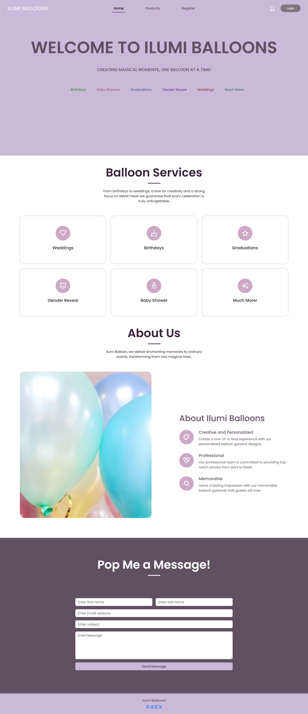
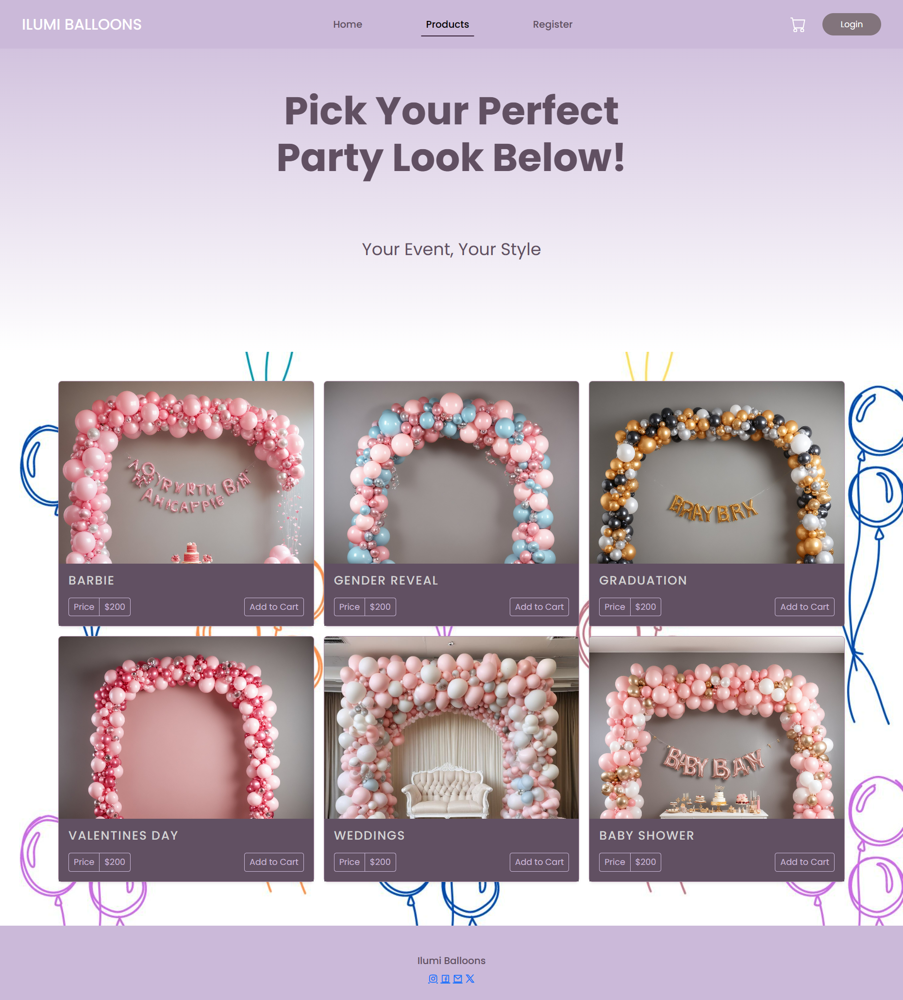
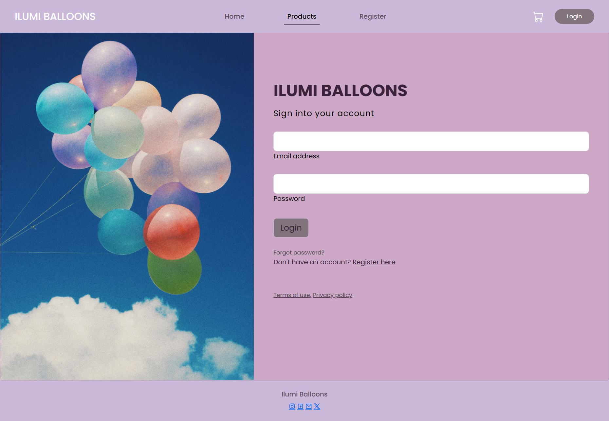

# E-Commerce
 E-Commerce Website 
This is my balloon business website called Ilumi Balloons. I created this website to show my skills in coding html, css and bootstrap. 

<h1>Home Page</h1>

  

  Products Page
  

  
  

  
Signup Page
  
  

  
Checkout Page
  
  

  
Login Page
  

This was a part of my code that I really enjoyed 

